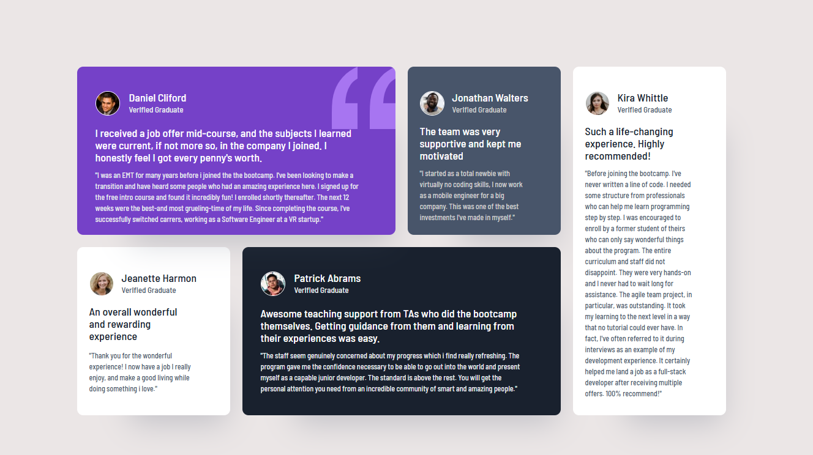

# Frontend Mentor - Bento grid solution

This is a solution to the [Testimonials grid section challenge on Frontend Mentor](https://www.frontendmentor.io/challenges/testimonials-grid-section-Nnw6J7Un7). Frontend Mentor challenges help you improve your coding skills by building realistic projects. 

## Overview
The Testimonials Grid Section is a clean, responsive layout designed to display multiple user testimonials in a structured yet visually appealing way. Inspired by modern UI card layouts, the design uses a grid-based system where each testimonial card is styled with its own background, typography, and hierarchy, creating a balanced and engaging presentation.

## Features
- Grid-based layout – Leverages CSS Grid for precise control of rows and columns.
- Responsive design – Seamlessly adapts to mobile, tablet, and desktop screens using media queries.
- Distinct content blocks – Each testimonial card has its own background color, text, and imagery for clarity and visual appeal.
- Flexible structure – Combines CSS Grid and Flexbox inside items for better content alignment and spacing.
- Custom styling – Rounded corners, spacing, and color schemes enhance aesthetics and user experience.

### The challenge
Users should be able to:
- View the optimal layout for the site depending on their device's screen size

### Screenshot

### Live Site Url
https://echo-script0.github.io/Testimonial-grid/

### Built with
This project is built using modern web technologies and best practices:
- HTML5 – Semantic markup for a clean and accessible structure.
- CSS3 – Styling and layout customization.
- CSS Flexbox – For aligning and spacing content within each grid item.
- CSS Grid – For creating the overall grid layout and precise item placement.
- Google Fonts – Barlow Semi Condensed for modern typography.
 

## Author
- Aisha Adeyemo
- Frontend Mentor - (https://www.frontendmentor.io/profile/echo-script0)

